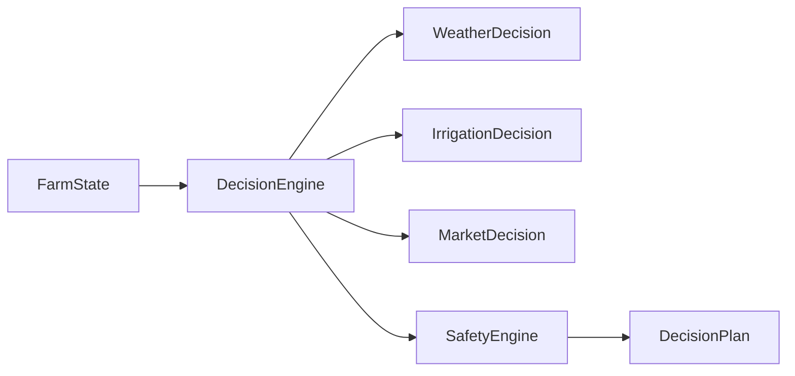

# BHOOMI V2 — Farm Decision Engine & Briefing Intelligence

## 1. Grounded Agricultural Decision Making
BHOOMI V2 never issues ungrounded advice. Every decision output by `FarmDecisionEngine` contains:
- `priority`: `CRITICAL`, `HIGH`, `MEDIUM`, `LOW`
- `action`: Concrete physical task (e.g., "Postpone irrigation by 48 hours")
- `reason`: Grounded agronomic rationale
- `urgency`: `IMMEDIATE`, `WITHIN_24_HOURS`, `WITHIN_3_DAYS`, `ROUTINE`
- `deadline`: Definite actionable window
- `expected_benefit`: Yield or financial protection
- `risk_if_ignored`: Transparent consequence
- `confidence`: Calibrated score (0.0 to 1.0)
- `evidence`: Authoritative agricultural citation (ICAR, ANGRAU, CIBRC)

---

## 2. Daily & Weekly Farm Briefings
Answers:
- **"What should I do today?"**:
  - Highest priority task
  - Weather-contingent advisory
  - Crop health & disease scouting
  - Irrigation decision
  - Mandi market status
- **"What should I do this week?"**:
  - Upcoming crop stage transitions, operational expenses, harvest logistics, and weather risks.

---

## 3. Decision Pipeline Flow

