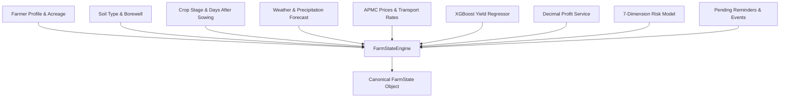

# BHOOMI V2 — Farm State Engine & Real-Time Aggregator

## 1. Overview
The `FarmStateEngine` is the single source of truth for all autonomous farm-level reasoning.
It aggregates data from 12 distinct agricultural, environmental, and financial services into a unified `FarmState` object.



---

## 2. Canonical Schema
```json
{
  "farmer_id": "farmer_demo_1",
  "farmer_name": "Ramesh Kumar",
  "preferred_language": "te",
  "location": "Tenali, Guntur, Andhra Pradesh",
  "total_acres": 3.0,
  "soil_type": "black",
  "irrigation_source": "borewell",
  "active_crop": "Chilli",
  "variety": "Teja",
  "crop_stage": "flowering",
  "days_after_sowing": 45,
  "weather_summary": {
    "temperature_c": 31.5,
    "humidity_percent": 78,
    "rain_probability": 40,
    "condition": "Partly Cloudy"
  },
  "expected_yield_quintals_per_acre": 10.0,
  "total_estimated_yield_quintals": 30.0,
  "market_modal_price_per_quintal": 12200.0,
  "net_realization_per_quintal": 12120.0,
  "projected_net_profit": 296000.0,
  "overall_risk_level": "LOW",
  "data_freshness": {
    "weather": {"status": "CURRENT", "source": "IMD"},
    "market": {"status": "CURRENT", "source": "AGMARKNET"}
  }
}
```

---

## 3. Data Freshness Guard
Every dynamic external source tracks `retrieved_at`, `source`, and `freshness_status`.
If a source is unreachable, cached data is explicitly flagged as `CACHED` or `STALE` with transparent farmer notices.
