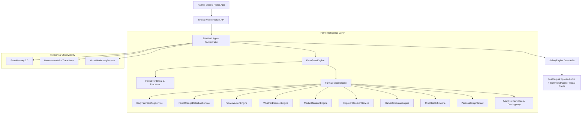

# BHOOMI V2 — Phase 3 Architecture: Autonomous Personal AI Farm Manager

## 1. System Vision
Phase 3 establishes BHOOMI as a proactive, autonomous **Personal AI Farm Manager**.
The platform operates on a continuous feedback loop:
$$\text{OBSERVE} \longrightarrow \text{UNDERSTAND} \longrightarrow \text{PREDICT} \longrightarrow \text{DECIDE} \longrightarrow \text{ACT} \longrightarrow \text{REMEMBER} \longrightarrow \text{ADAPT}$$

---

## 2. Integrated System Diagram

---

## 3. Core Operating Tenets
1. **Mathematical Determinism**: Financial ROI, net realization, yield totals, and what-if shifts are calculated in verified Python Decimal math.
2. **Authoritative Agronomy**: All pest, disease, and fertilizer recommendations are grounded in ICAR/SAU research and validated by SafetyEngine.
3. **Auditability & Explainability**: Every recommendation logs input parameters, tools executed, model versions, and safety checks into `RecommendationTraceStore`.
4. **Data Freshness**: Real-time status (`CURRENT`, `CACHED`, `STALE`) is explicitly displayed for weather and market data.
