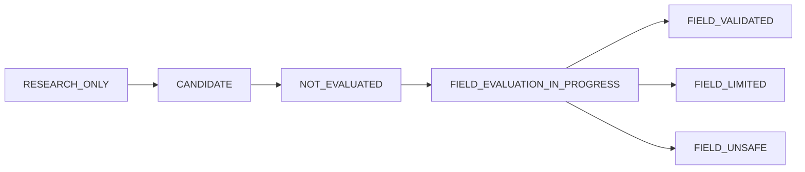

# BHOOMI V2 — Phase 5 Field Validation Protocol

**Author**: Google DeepMind / Antigravity Agent  
**Date**: September 3, 2026  
**Standard**: Real-World Agricultural Computer Vision Pathology Evaluation Protocol  
**Scope**: In-Field Mobile Smartphone Image Validation across 10 Crops  

---

## 1. Principles of Real-World Field Validation

Laboratory and benchmark datasets (such as PlantVillage) photograph excised plant leaves resting on uniform sheets of white, gray, or black paper under diffuse indoor lighting. While these datasets are useful for transfer learning and baseline architectural sanity, **they do not reflect the visual reality of Indian agricultural fields**.

Real-world foliar pathology images exhibit:
1. **Harsh and Dynamic Solar Angles**: Direct tropical midday sunlight creating specular glare, sharp shadow lines across veins, and extreme dynamic range.
2. **Environmental Artifacts**: Soil splash on lower foliage, dust coating, pesticide chemical residues (copper bluing, sulfur powder), dew drops, and rainwater sheen.
3. **Complex Canopy Clutter**: Overlapping leaves, weeds, stems, trellis twine, and cluttered natural soil backgrounds.
4. **Hardware and Lens Heterogeneity**: Low-cost Android smartphones with dirty camera lenses, compression artifacts, chromatic aberration, and autofocus jitter.

Field validation exists to measure this domain shift rigorously and objectively without false claims.

---

## 2. Ground-Truth Labeling Policy

Every field test image must undergo expert pathological review before entering the evaluation partition.

### A. Allowed Annotation States

| Annotation State | Criteria | Evaluation Policy |
| :--- | :--- | :--- |
| **`CONFIRMED`** | Pathologist has definitively identified the causal organism through unmistakable hallmark symptoms or laboratory microbiological/PCR culture confirmation. | Included in primary benchmark metrics (Accuracy, Macro-F1). |
| **`PROBABLE`** | Visual presentation strongly corresponds to a specific disease, but early onset or secondary saprophytic colonization introduces minor ambiguity. | Evaluated in secondary sensitivity metrics; reported separately. |
| **`UNCERTAIN`** | Foliar symptoms could belong to two or more overlapping pathogens (e.g. Cercospora vs Alternaria) or nutritional deficiency. | Must **NOT** be forced into a single disease label. Used to test model **abstention** and **uncertainty reporting**. |
| **`UNKNOWN`** | Etiology cannot be ascertained visually. | Model is expected to trigger abstention / out-of-distribution (OOD) flag. |

### B. Co-Infection and Multiple Diseases

A single leaf may manifest multiple pathological conditions simultaneously (e.g. Tomato Early Blight combined with Spider Mite stippling, or Chilli Leaf Curl with powdery mildew).
- **Primary Label**: Assigned to the dominant, crop-threatening condition.
- **Secondary Diseases**: Recorded as a comma-separated list in `secondary_diseases`.
- If the model predicts either the primary or secondary confirmed disease with low uncertainty, it is credited with a valid diagnostic detection.

### C. Poor-Quality Image Handling

Field scouts and farmers frequently upload suboptimal photographs. **Poor-quality images must NEVER be silently discarded**. They are cataloged to evaluate the defensive effectiveness of `ImageQualityGate`.

Categories of Quality Assessment:
- `PASSED`: Clear, focused, properly illuminated leaf sample.
- `BLUR`: Severe optical or motion blur destroying diagnostic lesion margins.
- `LOW_RESOLUTION`: Image smaller than $224 \times 224$ pixels or digitally over-zoomed.
- `DARK`: Underexposed leaf canopy (mean luminance $< 30/255$).
- `OVEREXPOSED`: Severe direct sunlight reflection washing out foliar color (mean luminance $> 245/255$).
- `OCCLUDED`: Target lesion obscured by trellis string, fingers, or foreign objects.
- `EXTREME_ANGLE`: High oblique perspective distorting lesion aspect ratio.
- `CORRUPTED`: Truncated payload, unreadable headers, or invalid MIME stream.
- `OTHER`: Physical tearing or decay unrepresentative of the disease.

---

## 3. Blind Evaluation Protocol

To prevent evaluation bias:
1. **Isolated Data Feed**: The evaluation engine loads images directly from `data/field_validation/images/<crop>/`.
2. **Metadata Stripping**: Model inference functions receive **ONLY** raw image bytes.
   - The model is **NEVER** provided `actual_disease`, `expert_label`, or metadata hints.
   - Filenames are randomized hash strings (`FLD_<HASH>.jpg`) that reveal neither the disease nor the farm location.
3. **Independent Prediction Recording**: The model executes inference, producing `VisionPrediction(disease, calibrated_confidence, is_ood, uncertainty_status)`.
4. **Post-Hoc Scoring**: Ground truth from `labels/expert_labels.csv` is joined **AFTER** all model predictions are finalized and frozen.

---

## 4. Farmer Privacy & PII Safeguards

BHOOMI V2 strictly prohibits collecting unnecessary Personally Identifiable Information (PII) during field validation:
- **Prohibited Data**: Farmer names, phone numbers, Aadhaar numbers, residential street addresses, survey numbers, or high-precision homestead GPS coordinates.
- **Pseudonymization**: If spatial grouping of samples from the same farm is necessary, a one-way cryptographic hash (`farmer_id_hash = SHA256(phone + secret_salt)[:16]`) is used.
- **Coordinate Truncation**: Where GPS coordinates are recorded for agro-climatic validation, they must be truncated to two decimal places ($\approx 1.1\text{ km}$ resolution).

---

## 5. Model Status Progression Rules

Every crop model moves through an explicit 6-stage lifecycle:

1. **`RESEARCH_ONLY`**: The model fails baseline benchmark criteria or exhibits unresolvable lesion confusion (e.g. Rice model at 35.2% Macro-F1). Prohibited from farmer advisory.
2. **`CANDIDATE`**: Model has passed controlled dataset tests ($\text{Macro-F1} \in [66\%, 83\%]$) with zero cross-split leakage, but field evaluation has not yet occurred.
3. **`NOT_EVALUATED`**: Model is benchmark validated ($\text{Macro-F1} > 85\%$), but zero independent on-farm smartphone images have been processed.
4. **`FIELD_EVALUATION_IN_PROGRESS`**: Real-world field images are currently being ingested and reviewed by pathologists.
5. **`FIELD_VALIDATED`**: Evaluated on $\ge 200$ independent on-farm smartphone photos across $\ge 5$ districts, maintaining $\text{Macro-F1} \ge 80\%$ with $\le 5\%$ dangerous false negatives.
6. **`FIELD_LIMITED`**: Usable in field conditions only with strict confidence gating (e.g. triggers diagnosis only when confidence $\ge 0.85$, abstains otherwise).
7. **`FIELD_UNSAFE`**: Real-world performance drops severely ($\Delta \text{Macro-F1} < -35\%$) due to field lighting or background confusion. Diagnosis is permanently disabled.
