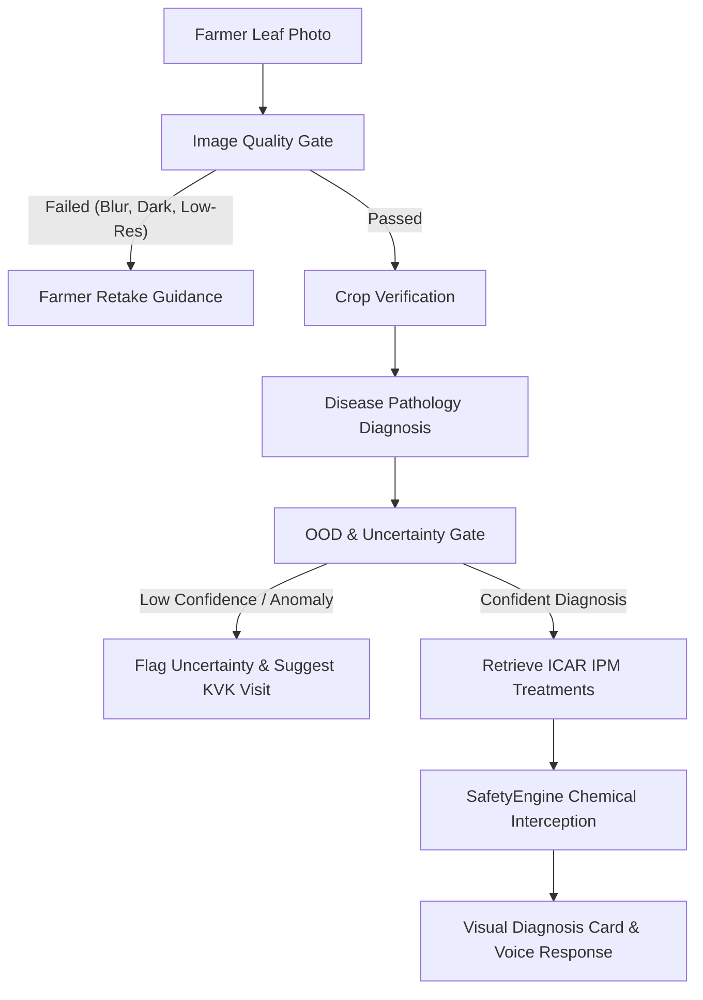

# BHOOMI V2 — Computer Vision Diagnostic & Pathology Report

## 1. Supported Crop Disease Collections
The BHOOMI V2 Multimodal Vision System manages pathology collections across 10 crops:
1. **Chilli**: Chilli Leaf Curl Virus (ChiLCV), Cercospora Leaf Spot, Healthy.
2. **Rice**: Bacterial Leaf Blight (BLB), Rice Blast (Magnaporthe oryzae), Brown Spot, Healthy.
3. **Tomato**: Tomato Leaf Curl Virus (ToLCV), Early Blight (Alternaria solani), Healthy.
4. **Potato**: Early Blight, Late Blight (Phytophthora infestans), Healthy.
5. **Sugarcane**: Red Rot (Colletotrichum falcatum), Healthy.
6. **Banana**: Leaf Speckle Disease, Sigatoka.
7. **Guava**: Canker, Rust.
8. **Corn/Maize**: Blight, Common Rust, Fall Armyworm damage.
9. **Cucumber & Pumpkin**: Powdery Mildew, Downy Mildew.
10. **Apple**: Scab, Black Rot, Cedar Apple Rust.

---

## 2. End-to-End Multimodal Vision Pipeline

---

## 3. Image Quality Gate Guardrails
- **Resolution Floor**: Minimum $224 \times 224$ pixels.
- **Illumination Range**: Average brightness $30 \le B \le 245$.
- **Aspect Ratio Limit**: Max $4.5:1$ (rejects extreme panoramic crops).
- **Sharpness / Blur Estimator**: Edge gradient variance.
- **Farmer Feedback**: Translates low-level image errors into supportive agricultural advice ("Hold phone closer", "Take photo in daylight", "Wipe camera lens").
