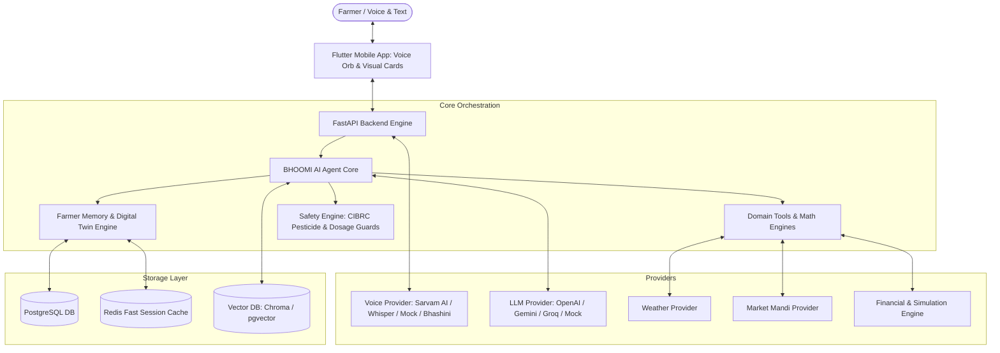

# BHOOMI V2 — Architecture Documentation

## 1. Product Vision
BHOOMI is a **Voice-First Multilingual Personal AI Farm Manager & Agricultural Decision Intelligence Platform**.
Its purpose is to guide farmers through the core agricultural loop:
$$\text{ASK} \rightarrow \text{REMEMBER} \rightarrow \text{PLAN} \rightarrow \text{MONITOR} \rightarrow \text{PREDICT} \rightarrow \text{COMPARE} \rightarrow \text{DECIDE} \rightarrow \text{REMIND} \rightarrow \text{ADAPT}$$

## 2. Core Principles
1. **Voice-First**: Speech is the primary interaction mode powered by Sarvam AI (`saaras:v2` and `bulbul:v1`).
2. **Deterministic Financial Math**: Exact `Decimal` arithmetic for revenue, costs, ROI, and What-If simulations.
3. **Evidence-Based Facts**: Weather and mandi prices come from authoritative data sources; LLMs never invent numerical figures.
4. **Safety-First**: SafetyEngine strictly blocks banned pesticides (e.g., Monocrotophos, Endosulfan) and enforces dosage / pollinator warnings.
5. **Phase 2 Extensibility**: Provider abstractions for ML crop recommendation, yield prediction, CV leaf disease diagnosis, and RAG knowledge base.
