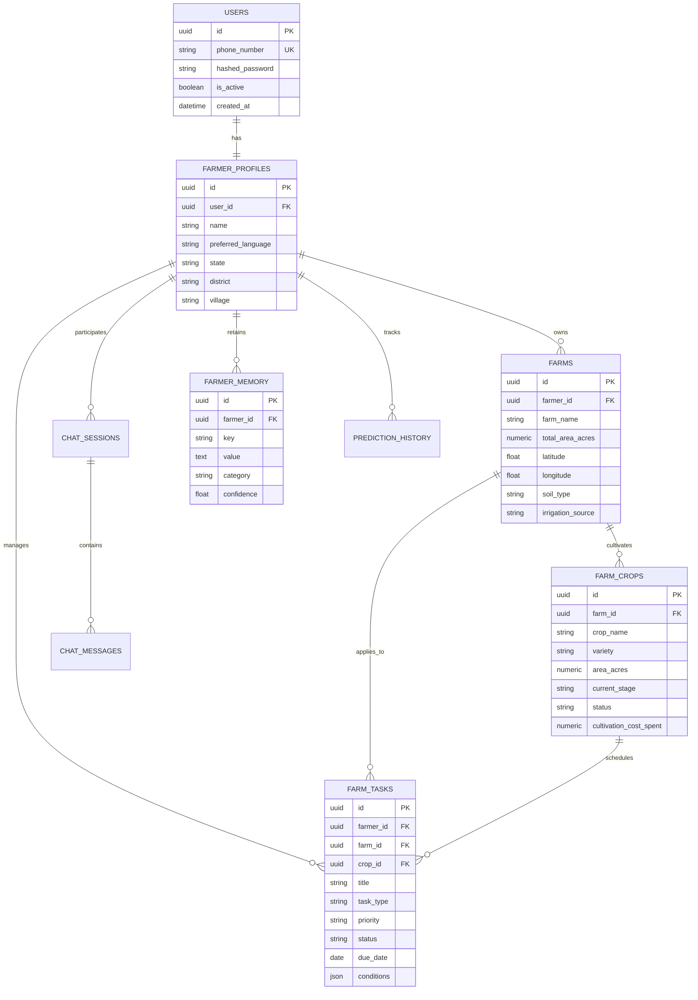

# BHOOMI V2 — Database Schema (PostgreSQL)

```mermaid
erDiagram
    USERS ||--|| FARMER_PROFILES : "has"
    FARMER_PROFILES ||--o{ FARMS : "owns"
    FARMS ||--o{ FARM_CROPS : "cultivates"
    FARMER_PROFILES ||--o{ CHAT_SESSIONS : "participates"
    CHAT_SESSIONS ||--o{ CHAT_MESSAGES : "contains"
    FARMER_PROFILES ||--o{ FARMER_MEMORY : "retains"
    FARMER_PROFILES ||--o{ FARM_TASKS : "manages"
    FARMS ||--o{ FARM_TASKS : "applies_to"
    FARM_CROPS ||--o{ FARM_TASKS : "schedules"
    FARMER_PROFILES ||--o{ PREDICTION_HISTORY : "tracks"

    USERS {
        uuid id PK
        string phone_number UK
        string hashed_password
        boolean is_active
        datetime created_at
    }

    FARMER_PROFILES {
        uuid id PK
        uuid user_id FK
        string name
        string preferred_language
        string state
        string district
        string village
    }

    FARMS {
        uuid id PK
        uuid farmer_id FK
        string farm_name
        numeric total_area_acres
        float latitude
        float longitude
        string soil_type
        string irrigation_source
    }

    FARM_CROPS {
        uuid id PK
        uuid farm_id FK
        string crop_name
        string variety
        numeric area_acres
        string current_stage
        string status
        numeric cultivation_cost_spent
    }

    FARM_TASKS {
        uuid id PK
        uuid farmer_id FK
        uuid farm_id FK
        uuid crop_id FK
        string title
        string task_type
        string priority
        string status
        date due_date
        json conditions
    }

    FARMER_MEMORY {
        uuid id PK
        uuid farmer_id FK
        string key
        text value
        string category
        float confidence
    }
```
