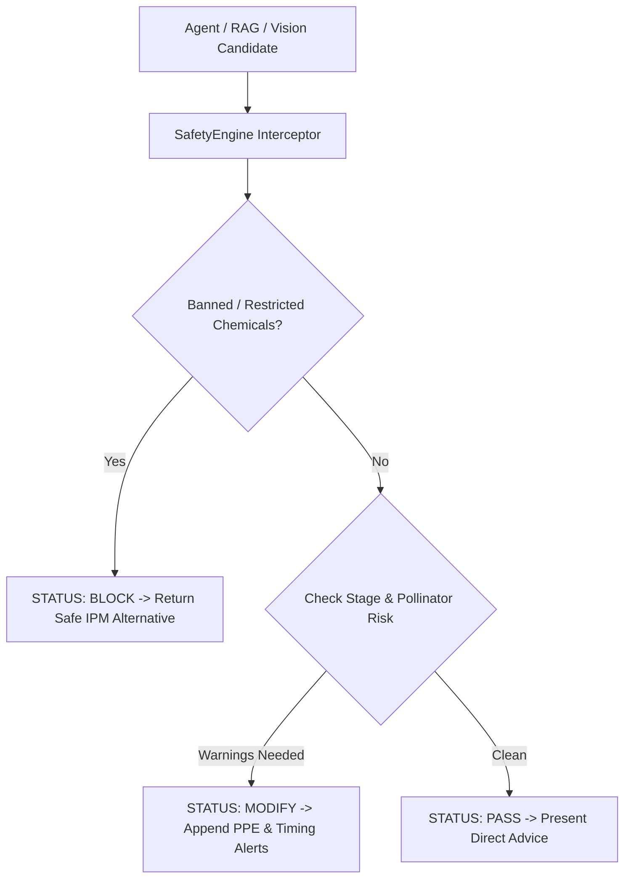

# BHOOMI V2 — Safety Engine Specification

## 1. Principles
Agricultural AI systems must never provide unvetted, hazardous chemical recommendations or toxic dosages to farmers.
BHOOMI implements a multi-layer `SafetyEngine` that intercepts and evaluates candidate advice before presenting it to the user.

## 2. Guardrails
1. **Banned / Restricted Substance Blocker**: Intercepts CIBRC-banned chemicals (Monocrotophos, Endosulfan, Paraquat, Phorate, etc.) and substitutes eco-friendly Integrated Pest Management (IPM) protocols.
2. **Pollinator Protection**: Checks whether the crop is in `flowering` or `pollination` stage and blocks or flags broad-spectrum morning sprays to protect honeybees and pollinators.
3. **PPE Mandatory Advisories**: Enforces protective gear reminders whenever chemical sprays are involved.
